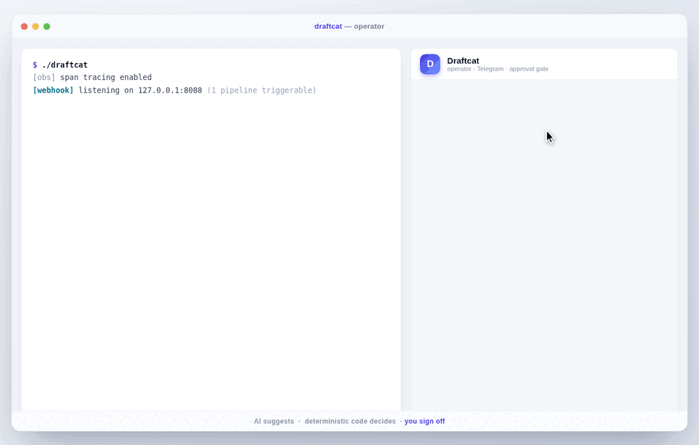

<p align="center">
  
</p>

<p align="center"><b>Governed AI pipelines for service businesses — one Go binary.</b></p>

<p align="center">
  <a href="https://github.com/renezander030/draftcat/stargazers"></a>
  <a href="LICENSE"></a>
  
  <a href="docs/voice.md"></a>
</p>

> **AI suggests. Deterministic code decides. The operator signs off.**

Draftcat runs YAML-defined pipelines that triage email, qualify leads, draft replies, extract data from PDFs, and govern self-hosted voice AI. Every outbound action passes an operator approval gate, every LLM call is budget-checked, and every fetched item is deduped against a SQLite state store. One business per instance, self-hosted, auditable.



## Quickstart

```bash
git clone https://github.com/renezander030/draftcat.git && cd draftcat
cp secrets.yaml.example secrets.yaml   # operator IDs + API keys
go build -o draftcat . && ./draftcat
```

Pipelines live in `config.yaml`, prompts in `skills/`. A SQLite store opens at `./state.db` on first boot. To add the EU-resident **voice AI** plugin: `go build -tags voice -o draftcat .` — the lean binary is unchanged when the tag is off.

## How it works

Each pipeline is a fixed sequence of typed steps. The LLM never chooses the next action — it produces structured output, the engine validates it against a schema, and an operator approves before anything reaches a customer.

| Step type       | What it does                                                          |
| --------------- | -------------------------------------------------------------------- |
| `deterministic` | Plain Go — fetch emails, parse PDFs, dedup, route, notify            |
| `ai`            | LLM inference with a skill template, budget-checked, schema-validated |
| `approval`      | Operator reviews via Telegram / Slack: approve / edit / reject       |

```yaml
pipelines:
  - name: invoice-due-diligence
    schedule: 1h
    steps:
      - {name: parse-pdf, type: deterministic, action: pdf_extract, vars: {path: /inbox/invoice.pdf}}
      - {name: extract,   type: ai,            skill: extract-line-items}
      - {name: verify,    type: deterministic, action: pdf_verify_cite, vars: {fail_on_unresolved: "true"}}
      - {name: review,    type: approval,      mode: hitl, channel: telegram}
```

## Why Draftcat

|                              | **Draftcat**                                   | **n8n**                               | **LangChain agents**             | **Agent harnesses** (Flue, Claude Code) |
| ---------------------------- | ---------------------------------------------- | ------------------------------------- | -------------------------------- | --------------------------------------- |
| **AI execution model**       | Deterministic boundary; AI cannot fire actions | Bolt-on LLM nodes in visual workflows | Agent decides next action freely | Agent acts autonomously in a sandbox    |
| **Human-in-the-loop**        | Required on every outbound step                | Optional manual nodes                 | Optional; not the default        | Optional (dispatch a message mid-run)   |
| **Token budgets**            | Per-step / pipeline / day, enforced            | None                                  | None                             | App-managed, not built in               |
| **Prompt-injection defense** | Input sanitization + output schema validation  | None                                  | None                             | Sandbox isolation; app-managed          |
| **State & dedup**            | SQLite-backed; items processed at most once    | DB-backed                             | In-memory                        | Session store / Durable Objects         |
| **Runtime**                  | Single Go binary                               | Node.js + Postgres                    | Python + dependency tree         | TypeScript, runtime-agnostic            |

Use n8n for drag-drop integrations across 400+ services. Use LangChain for research and open-ended exploration. Use an agent harness like [Flue](https://github.com/withastro/flue) when you want an agent to roam a sandbox and choose its own steps. Use Draftcat when a wrong LLM choice means a real customer gets emailed.

## Built-in actions

| Action                       | What it does                                                              |
| ---------------------------- | ------------------------------------------------------------------------ |
| `gmail_unread`               | Fetch unread Gmail messages (deduped per pipeline)                       |
| `ghl_new_contacts`           | Fetch recent GoHighLevel contacts (deduped)                             |
| `ghl_stale_opportunities`    | Fetch stalled GHL opportunities                                          |
| `ghl_unread_conversations`   | Fetch unread GHL conversations                                          |
| `pdf_extract`                | Parse a PDF into text + per-fragment bounding boxes (pure-Go)           |
| `pdf_verify_cite`            | Resolve `<cite>` tags in AI output against the parsed PDF               |
| `notify`                     | Send AI output to the operator channel                                  |
| `voice_*` / `dograh_*`       | Voice plugin actions (`-tags voice`)                                     |

Add an action by appending a `case` to the deterministic switch in `main.go` and registering its name in `internal/validate/`. See `internal/ghl/` and `internal/dograh/` for connector patterns.

## Governance

- **Token budgets** — per-step / pipeline / day; any breach halts the run immediately.
- **Human-in-the-loop** — every outbound action requires explicit operator approval.
- **Input sanitization** — operator input is scrubbed for prompt-injection patterns before the LLM.
- **Output validation** — AI output is checked against the skill's `output_schema` (field types, numeric `min`/`max`, `enum` membership) and rejected if it doesn't conform.
- **Rate limiting** — per-user, per-minute caps on operator interactions.
- **Channel security** — allowed-user lists + input-length limits enforced at startup; the engine refuses to start without them.
- **Observability** — opt-in structured JSON spans, one per pipeline and step (duration, status, tokens, cost). Off by default; `observability.spans: true` or `DRAFTCAT_TRACE=1`.

## State, dedup & triggers

State persists to SQLite (`./state.db` by default): fetched item IDs are deduped per `(pipeline, scope)` so items process at most once, every run is recorded (`started_at` / `ended_at` / `status`), and writes use WAL mode for crash safety without per-write fsync.

A pipeline's `schedule` decides when it runs — an interval (`1h`), `manual` (operator `/run` only), or `webhook`. The `webhook` server is opt-in and opens no port unless enabled:

```yaml
webhook: {enabled: true, addr: 127.0.0.1:8088, secret_env: DRAFTCAT_WEBHOOK_SECRET}
```

```bash
curl -X POST http://127.0.0.1:8088/hooks/invoice-due-diligence \
  -H "Authorization: Bearer $DRAFTCAT_WEBHOOK_SECRET" -d '{"path": "/inbox/invoice.pdf"}'
```

The body reaches the pipeline as `{{webhook_body}}` / `{{input}}`; bearer auth is constant-time, and a second trigger while the pipeline is running gets `409`. A webhook only *starts* a pipeline — the approval gate still runs, so an inbound request can never make the LLM fire an outbound action.

## Configuration

```yaml
provider:
  type: openrouter
  api_key_env: OPENROUTER_API_KEY

models:
  haiku: {model: anthropic/claude-haiku-4-5, max_tokens: 1024}

budgets:
  per_step_tokens:     2048
  per_pipeline_tokens: 10000
  per_day_tokens:      100000

observability: {spans: false}   # or DRAFTCAT_TRACE=1
state:         {path: ./state.db}
```

Skills are YAML prompt templates in `skills/` with an `output_schema` the engine enforces. With `-tags voice`, a `voice:` block configures the webhook receivers, Dograh endpoints, and pre-call lookup — see [docs/voice.md](docs/voice.md).

## Commands

```bash
draftcat                       # run the engine
draftcat validate [--strict]   # lint config + skills
draftcat test <pipeline>       # dry-run against fixtures/<pipeline>/ (never touches real APIs)
```

Pre-commit hooks (lefthook) run `gofmt`, `go vet`, `go build`, and `go test -short`; pre-push runs `draftcat validate --strict`.

## Voice AI plugin

Built with `-tags voice`, Draftcat becomes the **EU-resident writeback + governance layer** for self-hosted voice agents (Dograh, Pipecat, or any orchestrator that posts JSON webhooks): 5 lifecycle webhook receivers, sub-300ms pre-call context lookup, a 7-step Learning-Item review pipeline before any prompt/KB change ships, Dograh REST admin actions, and per-day call/minute budgets with bearer-auth webhooks. Full wiring recipe and runnable [DACH fixtures](fixtures/voice-dach-screener/pipeline.yaml) in [docs/voice.md](docs/voice.md).

## Patterns explained

The deterministic-boundary architecture is documented in the **Production AI Automation Notes** gist series, each mapping to draftcat code:

- [#1 Agent Approval Gates](https://gist.github.com/renezander030/9069db775e494ffd2cdd5a09adf83add) — proposed actions, schema validation, audit log
- [#2 Token Budgets](https://gist.github.com/renezander030/a7d99ad94b97f7943a9a04016d62faaa) — per-step / pipeline / day enforcement
- [#5 SQLite Dedup + Crash Safety](https://gist.github.com/renezander030/8a23e32cde0c882a5aa069c4bfdf697f) — WAL mode, `seen_items`, run audit
- [#6 Prompt-Injection Defense](https://gist.github.com/renezander030/213ffdf1ab1bdb169881927bc7080270) — input sanitization + output schema validation
- [#7 PDF Cite Verification](https://gist.github.com/renezander030/7780cbc0b3ad4e802e8fba8bfc1c3a66) — auditable LLM extraction with per-fragment bounding boxes

## Related projects

- [capcut-cli](https://github.com/renezander030/capcut-cli) — edit CapCut / JianYing video drafts from the CLI. Same DNA: single binary, no API, structured JSON boundary between agent and tool.

## Status

**v0.2** — early access. Single-business, single-operator deployments. Public APIs may change between minor versions until v1.0.

New in v0.2: webhook triggers (`schedule: webhook`), structured observability spans, and `enum` / `number` enforcement in output schemas. Planned: a generic HTTP action, per-step retry + circuit breaker, Slack approval, and an OpenTelemetry/Prometheus span exporter.

## License

MIT. See [LICENSE](LICENSE).
