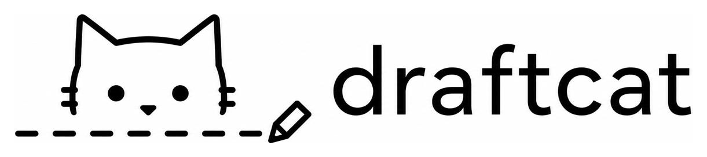
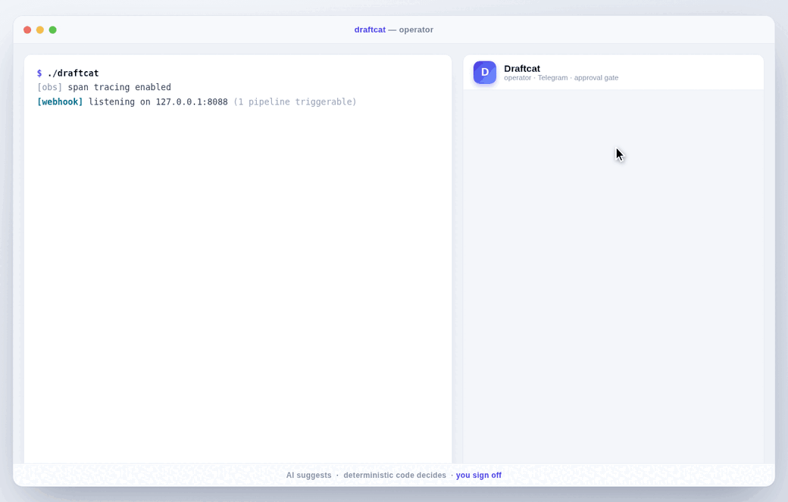
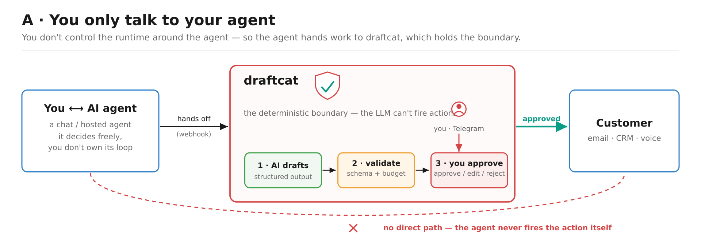
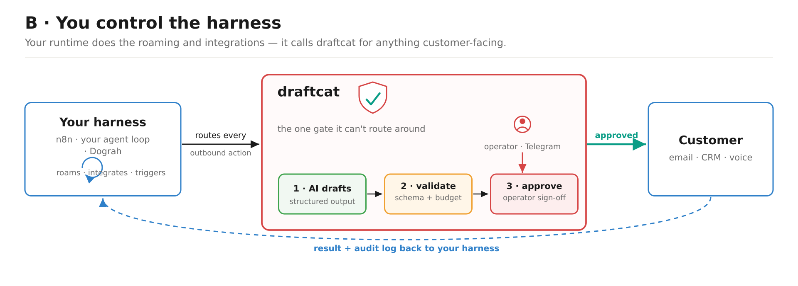
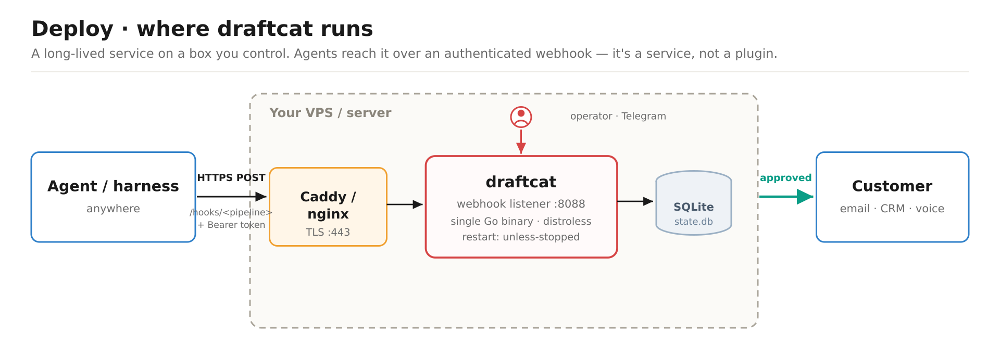
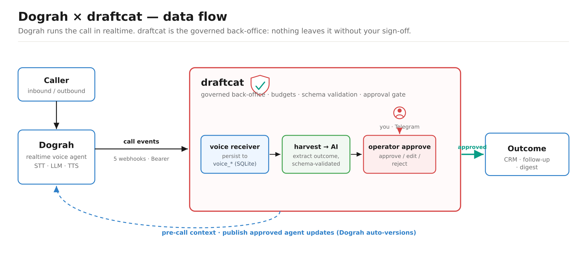

<p align="center">
  
</p>

<p align="center"><b>Governed AI pipelines where the LLM can't fire actions — one Go binary, self-hosted, human-in-the-loop.</b></p>

<p align="center">
  <a href="https://github.com/renezander030/draftcat/stargazers"></a>
  <a href="LICENSE"></a>
  
  <a href="docs/voice.md"></a>
  <a href="https://render.com/deploy?repo=https://github.com/renezander030/draftcat"></a>
</p>

> **AI suggests. Deterministic code decides. The operator signs off.**

Draftcat runs YAML-defined pipelines that triage email, qualify leads, draft replies, extract data from PDFs, and govern self-hosted voice AI. Every outbound action passes an operator approval gate, every LLM call is budget-checked, and every fetched item is deduped against a SQLite state store. One business per instance, self-hosted, auditable.

## Let a server count votes it cannot read

A normal approval server sees how every person voted. Draftcat's experimental **FHE encrypted tally** lets three or more reviewers turn `approve` or `reject` into unreadable ciphertext on their own machines. A collector combines those files without opening them; only the key owner can reveal the final count and learn whether quorum was met.

```text
reviewers encrypt votes  →  collector adds unreadable ballots  →  key owner opens one total
                              collector never sees yes or no
```

```bash
# Once per vote: create the private key and the public key reviewers receive.
./draftcat fhe-vote keygen

# Each reviewer encrypts locally. The readable vote is never sent.
./draftcat fhe-vote encrypt --public fhe-public.json --context invoice-4821 \
  --ballot <unique-random-invite> --vote approve --out reviewer.vote.json

# The collector combines 3+ encrypted ballots; the owner alone opens the result.
./draftcat fhe-vote tally --public fhe-public.json --context invoice-4821 \
  --out tally.json alice.vote.json bob.vote.json carol.vote.json
./draftcat fhe-vote decrypt --secret fhe-secret.json --context invoice-4821 \
  --expected 3 --quorum 2 tally.json
```

**Use it when** separate teams, companies, or committee members need a shared approval but the tally host must not know individual votes. Keep the collector separate from the key owner and give the key owner only the final tally. **Skip it when** the same trusted Draftcat owner may see the votes, fewer than three people vote, or you need a public audit receipt—the zero-knowledge feature below is for that. Ciphertext files are still sent; the plaintext votes are not. Read the [encrypted vote walkthrough and threat model](docs/fhe-vote-tally.md) before evaluating it.

## Prove approval without sharing the customer data

Sometimes a customer, auditor, or partner needs evidence that a human approved an AI action — but should **not** receive the message, the reviewer's identity, or your internal workflow. Draftcat can turn a signed approval row into a zero-knowledge proof:

| The verifier learns | What stays private |
| --- | --- |
| A direct human approval was recorded | Customer message and payload hash |
| The required reviewer quorum was met | Reviewer identity and exact vote counts |
| The proof came from the Draftcat instance key they pinned | Pipeline, step, time, nonce, and instance secret |

```bash
# Operator: publish this commitment once through a trusted channel.
./draftcat zk-receipt key-id

# Operator: create a shareable proof for the latest human approval.
./draftcat zk-receipt prove --out approval.proof.json invoice-due-diligence

# Customer or auditor: verify it without DRAFTCAT_APPROVAL_SECRET or database access.
./draftcat zk-receipt verify --expect-key <pinned-key-commitment> approval.proof.json
```

This is an **experimental cryptographic preview**, not a production compliance claim. It uses an embedded BN254/Groth16 circuit and a development single-party setup; the circuit has not received an independent audit. Use it to evaluate the disclosure model, then replace the setup through a ceremony before relying on it in production. See [zero-knowledge approval proofs](docs/zk-approval-proofs.md) for the trust model, exact statement, and limitations.

> **New in v0.7.0:** execution decisions now carry their proof. Every tool-gate route is authenticated, each request has a stable action identity and exact policy binding, and an allowed decision becomes an atomic consume-once permit before the side effect runs. Webhook acceptance is durable before HTTP 202 and can be polled after handoff. Versioned receipts bind action, payload, policy, and expiry, with `draftcat receipts list|show|export` for verification-ready JSONL. Ordered `model_policy` rules can deny or send matching model input/output to a human, while `/healthz` and `/readyz` give orchestrators a safe listener contract.
>
> **In v0.6.0:** the gate holds under load. The [tool-call gate](docs/tool-gate.md) answers asynchronously (`mode: async`, `wait:`) so a harness with a short HTTP timeout never loses a decision, and a tool call waiting on a human is durable across a restart. Rules constrain arguments (`args:` - glob, regex, `one_of`, `min`/`max`) and never widen on a mismatch. A repeat guard stops an agent that loops on one call from paging you, the operator hears about denials the gate made on its own, `/pending` and `draftcat pending` list every open gate, `/status` shows spend against caps, cost caps enforce the provider's real charge, rate limits back off instead of failing the run - and one Telegram update pump fixes taps that were silently lost while two gates were open at once.



## Why Draftcat

|                              | **Draftcat**                                   | **n8n**                               | **LangChain agents**             | **Agent harnesses** (Flue, Claude Code) |
| ---------------------------- | ---------------------------------------------- | ------------------------------------- | -------------------------------- | --------------------------------------- |
| **AI execution model**       | Deterministic boundary; AI cannot fire actions | Bolt-on LLM nodes in visual workflows | Agent decides next action freely | Agent acts autonomously in a sandbox    |
| **Human-in-the-loop**        | Required on every outbound step                | Optional manual nodes                 | Optional; not the default        | Optional (dispatch a message mid-run)   |
| **Token budgets**            | Per-step / pipeline / day, enforced            | None                                  | None                             | App-managed, not built in               |
| **Prompt-injection defense** | Input sanitization + output schema validation  | None                                  | None                             | Sandbox isolation; app-managed          |
| **State & dedup**            | SQLite-backed; items processed at most once    | DB-backed                             | In-memory                        | Session store / Durable Objects         |
| **Runtime**                  | Single Go binary                               | Node.js + Postgres                    | Python + dependency tree         | TypeScript, runtime-agnostic            |

Use n8n for drag-drop integrations across 400+ services. Use LangChain for research and open-ended exploration. Use an agent harness like [Flue](https://github.com/withastro/flue) when you want an agent to roam a sandbox and choose its own steps. Use Draftcat when a wrong LLM choice means a real customer gets emailed.

## How draftcat fits

However your agent runs, draftcat sits between it and your customer systems as a **mandatory approval gate** — not a tool the model can route around. The same gate holds in both setups:

<p align="center">
  
</p>

**You only talk to your agent.** You don't control its runtime, so it hands work to draftcat over a webhook — but it can only *start* a gated pipeline, never fire a customer-facing action itself.

<p align="center">
  
</p>

**You control the harness.** Your runtime (n8n, your own agent loop, Dograh) does the roaming and integrations, then routes every outbound action through draftcat — the one gate it can't bypass — and gets the result plus an audit trail back.

## Governance

- **Token budgets** — per-step / pipeline / day; any breach halts the run immediately.
- **Cost budgets** — `per_day_cost` / `per_pipeline_cost` cap spend in money. On OpenRouter the caps are enforced on the charge the provider reports for each call (cached and reasoning tokens included); elsewhere on your configured per-1k rates. The approval prompt shows what the run has spent, and `/status` shows the day against every cap.
- **Human-in-the-loop** — every outbound action requires an explicit operator decision, made live or declared in advance.
- **Any operator channel** — the [`hitl/v0` protocol](docs/hitl-protocol.md) keeps draftcat as the gate and lets an untrusted relay own presentation. Teams runs through a Power Automate flow in your own tenant: no bot, no Azure app registration, no admin consent. Check yours with `draftcat hitl verify <relay-url>`.
- **Consume-once tool permits** - `POST /gate/tool-call` puts an agent's MCP or SDK call through the same gate as a pipeline step. Bearer authentication covers ask, poll, and consume. A stable `action_id` makes retries idempotent; the binding covers the exact arguments, policy, and expiry; only the first successful `POST /gate/tool-call/<id>/consume` carries `permit: execute`. See [`docs/tool-gate.md`](docs/tool-gate.md).
- **Repeat guard** — inside `repeat_window` an identical tool call (same agent, tool, arguments) gets the gate's remembered answer instead of a new prompt: a denied call stays denied, an in-flight call joins the open prompt, and `max_repeats` stops a looping agent from paging you.
- **Denial notices** — a refusal the gate makes on its own (unlisted tool, argument outside a rule, repeat guard) is reported to the operator channel, one notice per agent, tool and reason per window, so nothing is refused silently.
- **Open gates** — `/pending` on the channel and `draftcat pending` on the host list every approval waiting on a human, pipeline steps and tool calls alike, with how long each has waited and how long it has left.
- **Risk tiers** — steps declare `risk: low | normal | high`, and `approval_policy` can pre-approve a declared class. High risk never qualifies, and each exemption is audited as `policy_approve` with the rule that fired.
- **Escalation** — `escalate_after` re-notifies before a gate times out; `escalate_to` widens who is told, never who may decide.
- **Durable, run-correlated gates** — every gate is written to SQLite before the draft goes out, so an approval in flight survives a restart, and each decision records the run it released.
- **Approver scoping** — `approvers:` on a step narrows who may decide it to a subset of `allowed_users`. Quorum says *how many*; this says *which ones*. It can only narrow, never widen.
- **Model I/O policy** - ordered `model_policy` regex rules check exact input before it reaches the provider and output before it leaves Draftcat. A match can deny or enter the existing human approval gate, and the decision is written as a versioned receipt.
- **Input sanitization** — operator input is scrubbed for prompt-injection patterns before the LLM.
- **Output validation** — AI output is checked against the skill's `output_schema` (field types, numeric `min`/`max`, `enum` membership) and rejected if it doesn't conform.
- **Checked action receipts** - v2 receipts bind immutable action ID, payload hash, policy digest, validity window, run, and decision. List, inspect, or stream JSONL from SQLite with `draftcat receipts`; see [`docs/action-receipts.md`](docs/action-receipts.md).
- **Durable webhook admission** - Draftcat writes a body-hash-only admission row before returning HTTP 202. The response includes `admission_id` and an authenticated poll URL; unfinished admissions become `interrupted` after restart.
- **Health contract** - `GET /healthz` reports process liveness and `GET /readyz` succeeds only while the SQLite decision store is available.
- **Private approval proofs** — share proof that a direct human approval met quorum without sharing the action, approver, or counts; see [`docs/zk-approval-proofs.md`](docs/zk-approval-proofs.md).
- **Encrypted approval tally** — combine three or more encrypted votes without letting the collector read any individual vote; see [`docs/fhe-vote-tally.md`](docs/fhe-vote-tally.md).
- **Rate limiting** — per-user, per-minute caps on operator interactions.
- **Channel security** — allowed-user lists + input-length limits enforced at startup; the engine refuses to start without them.
- **Config validated on boot** — the engine runs the same checks as `draftcat validate` at startup and refuses to start on errors, so problems surface at boot rather than mid-run. `DRAFTCAT_SKIP_VALIDATE=1` overrides.
- **Observability** — opt-in structured JSON spans, one per pipeline and step (duration, status, tokens, cost). Off by default; `observability.spans: true` or `DRAFTCAT_TRACE=1`.

## Quickstart

Install the native binary through npm (Node.js 18 or newer):

```bash
npm install -g draftcat
draftcat --help
```

The installer downloads the matching Linux, macOS, or Windows binary and verifies it against the checksums attached to the GitHub release. No Go toolchain is required.

Or build from source:

```bash
git clone https://github.com/renezander030/draftcat.git && cd draftcat
cp secrets.yaml.example secrets.yaml   # operator IDs + API keys
go build -o draftcat . && ./draftcat
```

**Or with Docker** (no Go toolchain needed):

```bash
git clone https://github.com/renezander030/draftcat.git && cd draftcat
cp secrets.yaml.example secrets.yaml
docker compose up
```

Pipelines live in `config.yaml`, prompts in `skills/`. A SQLite store opens at `./state.db` on first boot. To add the EU-resident **voice AI** plugin: `go build -tags voice -o draftcat .` — the lean binary is unchanged when the tag is off.

## Deploy — where it runs

draftcat is a **service you self-host**, not a plugin an agent loads. It runs as a long-lived process and pings you on Telegram to approve each action. Pick the path that fits.

### No server? One click on Render

[](https://render.com/deploy?repo=https://github.com/renezander030/draftcat)

Click, sign in, and paste three values — your Telegram bot token, an OpenRouter key, and your Telegram user ID. Render runs it always-on with a persistent disk: no VPS, no shell, no TLS to configure. (It deploys as a background worker, so it has no public URL — ideal for the "watch my inbox, approve on Telegram" job. For inbound agent webhooks, use a host you control, below.)

### Have a VPS with Docker? One line

```bash
curl -fsSL https://raw.githubusercontent.com/renezander030/draftcat/master/install.sh | sh
```

Pulls the image, scaffolds `~/draftcat/.env` + a compose file with a state volume, and prints the two steps left (fill the `.env`, then `docker compose up -d`). Config and skills are baked into the image.

### Run the container yourself

```bash
docker run -d --restart unless-stopped \
  -v draftcat-state:/data -e DRAFTCAT_STATE_PATH=/data/state.db \
  -e DRAFTCAT_TG_TOKEN -e OPENROUTER_API_KEY \
  -e DRAFTCAT_TG_ALLOWED_USERS=<your-telegram-id> \
  ghcr.io/renezander030/draftcat
```

Or `docker compose up` from a clone — builds the same image and mounts your local `config.yaml`/`skills/` so you can edit pipelines.

### Receiving inbound from an agent or harness

The setups above run the always-on operator loop. To let an external agent or harness *trigger* pipelines, enable the webhook in `config.yaml` (`schedule: webhook` on the pipeline), publish the port, and put Caddy/nginx in front for TLS:



```yaml
webhook:
  enabled: true
  addr: 0.0.0.0:8088
  secret_env: DRAFTCAT_WEBHOOK_SECRET
```

```bash
curl -X POST https://draftcat.yourco.eu/hooks/<pipeline> \
  -H "Authorization: Bearer $DRAFTCAT_WEBHOOK_SECRET" \
  -d '{ "lead": "..." }'
```

The POST only **starts** a gated pipeline — the approval step still runs, so inbound can never make the LLM fire a customer-facing action.
Draftcat writes the admission to SQLite before returning `202`:

```json
{"admission_id":"wh_...","status":"accepted","poll":"/hooks/status/wh_..."}
```

Poll that path with the same bearer token. `GET /healthz` is a liveness check;
`GET /readyz` verifies that the decision store is reachable.

## How it works

Each pipeline is a fixed sequence of typed steps. The LLM never chooses the next action — it produces structured output, the engine validates it against a schema, and an operator approves before anything reaches a customer.

| Step type       | What it does                                                          |
| --------------- | -------------------------------------------------------------------- |
| `deterministic` | Plain Go — fetch emails, parse PDFs, dedup, route, notify            |
| `ai`            | LLM inference with a skill template, budget-checked, schema-validated |
| `approval`      | Operator reviews via Telegram: approve / edit / reject                |

```yaml
pipelines:
  - name: invoice-due-diligence
    schedule: 1h
    steps:
      - {name: parse-pdf, type: deterministic, action: pdf_extract, vars: {path: /inbox/invoice.pdf}}
      - {name: extract,   type: ai,            skill: extract-line-items}
      - {name: verify,    type: deterministic, action: pdf_verify_cite, vars: {fail_on_unresolved: "true"}}
      - {name: review,    type: approval,      mode: hitl, channel: telegram}
```

## Built-in actions

| Action                       | What it does                                                              |
| ---------------------------- | ------------------------------------------------------------------------ |
| `gmail_unread`               | Fetch unread Gmail messages (deduped per pipeline)                       |
| `whatsapp_intake`            | Normalize inbound WhatsApp JSON into governed pipeline input             |
| `ghl_new_contacts`           | Fetch recent GoHighLevel contacts (deduped)                             |
| `ghl_stale_opportunities`    | Fetch stalled GHL opportunities                                          |
| `ghl_unread_conversations`   | Fetch unread GHL conversations                                          |
| `pdf_extract`                | Parse a PDF into text + per-fragment bounding boxes (pure-Go)           |
| `pdf_verify_cite`            | Resolve `<cite>` tags in AI output against the parsed PDF               |
| `notify`                     | Send AI output to the operator channel                                  |
| `voice_*` / `dograh_*`       | Voice plugin actions (`-tags voice`)                                     |

Add an action by appending a `case` to the deterministic switch in `main.go` and registering its name in `internal/validate/`. See `internal/ghl/` and `internal/dograh/` for connector patterns.

For WhatsApp, run a small whatsmeow receiver as the session owner and POST its
normalized message JSON into a `schedule: webhook` pipeline that starts with
`whatsapp_intake`; see [`docs/whatsapp.md`](docs/whatsapp.md).

## Configuration

```yaml
provider:
  type: openrouter
  api_key_env: OPENROUTER_API_KEY

models:
  haiku: {model: anthropic/claude-haiku-4-5, max_tokens: 1024}

budgets:
  per_step_tokens:     2048
  per_pipeline_tokens: 10000
  per_day_tokens:      100000
  per_day_cost:        5.00     # money cap, same unit as your model rates (0 = off)
  per_pipeline_cost:   0.50

observability: {spans: false}   # or DRAFTCAT_TRACE=1
state:         {path: ./state.db}
```

An approval step can narrow who may decide it:

```yaml
- name: release-payment
  type: approval
  channel: telegram
  quorum: 2                     # how many must approve
  approvers: [111111, 222222]   # which ones (subset of allowed_users)
```

Cost caps are checked between calls: a call is refused once spend has reached the cap. Pair them with `per_step_tokens` to bound the size of any single call. A transient provider failure (429, 408, 5xx) is retried with backoff — honouring `Retry-After` — before it fails a step; `provider.max_retries` sets the budget.

The tool-call gate is configured the same way, per tool:

```yaml
tool_gate:
  enabled: true                       # served on the webhook listener
  repeat_window: 10m                  # identical call → same answer, no second prompt
  tools:
    - name: read_calendar             # listed = allowed, audited
    - name: send_email
      risk: high
      require_approval: true
      args:
        to: {glob: "*@example.com"}   # inside the rule: ask as usual
      on_mismatch: deny               # outside it: refuse without asking
```

Every gate request uses the webhook bearer token. Send a stable `action_id`,
then consume an allowed binding exactly once before running the side effect:

```bash
curl -X POST http://127.0.0.1:8088/gate/tool-call \
  -H "Authorization: Bearer $DRAFTCAT_WEBHOOK_SECRET" \
  -H 'Content-Type: application/json' \
  -d '{"action_id":"send-invoice-4821","tool":"send_email","args":{"to":"billing@example.com"}}'

curl -X POST http://127.0.0.1:8088/gate/tool-call/send-invoice-4821/consume \
  -H "Authorization: Bearer $DRAFTCAT_WEBHOOK_SECRET" \
  -H 'Content-Type: application/json' \
  -d '{"binding_hash":"sha256:..."}'
```

Model input and output policy is ordered and deterministic. `deny` fails the
LLM call closed; `review` pauses at the configured operator channel:

```yaml
model_policy:
  max_preview_chars: 800
  rules:
    - id: credentials-in-input
      phase: input
      pattern: '(?i)(api[_ -]?key|password)'
      action: review
      reason: Credentials require an explicit operator decision.
    - id: unsupported-claim
      phase: output
      roles: [drafter]
      pattern: '(?i)guaranteed results'
      action: deny
      reason: Do not send unsupported guarantees.
```

Skills are YAML prompt templates in `skills/` with an `output_schema` the engine enforces. With `-tags voice`, a `voice:` block configures the webhook receivers, Dograh endpoints, and pre-call lookup — see [docs/voice.md](docs/voice.md).

## Commands

```bash
draftcat                       # run the engine (validates config first; refuses to start on errors)
draftcat validate [--strict]   # lint config + skills
draftcat test <pipeline>       # dry-run against fixtures/<pipeline>/ (never touches real APIs)
draftcat runs [pipeline]       # recent runs + the approval decisions in each (--json to archive)
draftcat pending               # approval gates waiting on a human right now (--json)
draftcat receipts list         # approval receipts and verification status (--json)
draftcat receipts show <id>    # one versioned receipt
draftcat receipts export       # JSONL to stdout (--out path writes mode 0600)
draftcat audit-verify          # verify signed approval receipts
draftcat hitl verify <url>     # run the hitl/v0 conformance suite against a relay
```

`draftcat runs` reads the governance record back out of SQLite: what ran, when, and who decided what.

```
2026-07-26T05:37:31Z  invoices    ok    60.0s
    release-payment      adjust      by 111 (0/2)
    release-payment      approve     by 222 (2/2) [signed]
```

Per-step timings and token counts live in the observability spans (`observability.spans`, OTLP/Prometheus). This is the durable record of decisions.

Pre-commit hooks (lefthook) run `gofmt`, `go vet`, `go build`, `go test -short`, and `golangci-lint` on new code; pre-push runs `draftcat validate`.

## State, dedup & triggers

State persists to SQLite (`./state.db` by default): fetched item IDs are deduped per `(pipeline, scope)` so items process at most once, every run is recorded (`started_at` / `ended_at` / `status`), and writes use WAL mode for crash safety without per-write fsync.

Approval rows can be made tamper-evident with signed receipts, so a later audit
can verify which operator approved which payload hash. See
[`docs/action-receipts.md`](docs/action-receipts.md).

A pipeline's `schedule` decides when it runs — an interval (`1h`), `manual` (operator `/run` only), or `webhook`. The `webhook` server is opt-in and opens no port unless enabled:

```yaml
webhook: {enabled: true, addr: 127.0.0.1:8088, secret_env: DRAFTCAT_WEBHOOK_SECRET}
```

```bash
curl -X POST http://127.0.0.1:8088/hooks/invoice-due-diligence \
  -H "Authorization: Bearer $DRAFTCAT_WEBHOOK_SECRET" -d '{"path": "/inbox/invoice.pdf"}'
```

The body reaches the pipeline as `{{webhook_body}}` / `{{input}}`; bearer auth is constant-time, and a second trigger while the pipeline is running gets `409`. Before `202`, Draftcat stores an admission ID, pipeline, body hash, and status in SQLite. `GET /hooks/status/<admission_id>` returns the authenticated status without retaining the request body. A webhook only *starts* a pipeline - the approval gate still runs, so an inbound request can never make the LLM fire an outbound action.

**Signed requests.** Bind each trigger to its exact body and a timestamp with an HMAC receipt, on top of the bearer token:

```yaml
webhook:
  enabled: true
  secret_env: DRAFTCAT_WEBHOOK_SECRET
  require_signature: true
  max_skew_seconds: 300      # default
```

```
X-Draftcat-Signature: t=<unix>,v1=<hex hmac-sha256(t + "." + body)>
```

Requests outside the skew window are refused, and each signature is spent once (recorded in the dedup table), so a captured request cannot be re-fired. A signature header is always verified when present, even with `require_signature: false`.

## Voice AI plugin

> **Hook up your Dograh to your draftcat instance!**



Built with `-tags voice`, Draftcat becomes the **EU-resident writeback + governance layer** for self-hosted voice agents (Dograh, Pipecat, or any orchestrator that posts JSON webhooks): 5 lifecycle webhook receivers, sub-300ms pre-call context lookup, a 7-step Learning-Item review pipeline before any prompt/KB change ships, Dograh REST admin actions, and per-day call/minute budgets with bearer-auth webhooks. Full wiring recipe and runnable [DACH fixtures](fixtures/voice-dach-screener/pipeline.yaml) in [docs/voice.md](docs/voice.md).

## Patterns explained

The deterministic-boundary architecture is documented in the **Production AI Automation Notes** gist series, each mapping to draftcat code:

- [#1 Agent Approval Gates](https://gist.github.com/renezander030/9069db775e494ffd2cdd5a09adf83add) — proposed actions, schema validation, audit log
- [#2 Token Budgets](https://gist.github.com/renezander030/a7d99ad94b97f7943a9a04016d62faaa) — per-step / pipeline / day enforcement
- [#5 SQLite Dedup + Crash Safety](https://gist.github.com/renezander030/8a23e32cde0c882a5aa069c4bfdf697f) — WAL mode, `seen_items`, run audit
- [#6 Prompt-Injection Defense](https://gist.github.com/renezander030/213ffdf1ab1bdb169881927bc7080270) — input sanitization + output schema validation
- [#7 PDF Cite Verification](https://gist.github.com/renezander030/7780cbc0b3ad4e802e8fba8bfc1c3a66) — auditable LLM extraction with per-fragment bounding boxes
- [#11 Pipeline Fixture Testing](https://gist.github.com/renezander030/a058fc0d5e7e7fa209d30cfa48e82ebb) — dry-run pipelines from JSON fixtures; zero API calls in CI
- [#12 LLM Skills as YAML](https://gist.github.com/renezander030/a28f118dec07d275ccc825aa833aba92) — prompt + output_schema + role in versioned YAML, validated by a linter
- [#13 Inbound Agent Webhook Auth](https://gist.github.com/renezander030/26d46d4c7fb9ab1b43fe19bc5bad6d07) — constant-time bearer token, fail-closed on empty secret, async 202 dispatch
- [#14 Self-Improving Voice Agent](https://gist.github.com/renezander030/262d8b8c44b4cddf51b3b84c40f3f669) — harvest Learning-Items, group, propose a minimal workflow diff, two approval gates, git commit + auto-versioned Dograh publish
- [#15 AI Action Audit Trail](https://gist.github.com/renezander030/ad81c7a805a09a844983f881e2c487e5) — append-only `action_approvals` table + queries: who approved which payload, when; find gated actions that ran with no approval (GDPR Art. 22)

## Related projects

- [capcut-cli](https://github.com/renezander030/capcut-cli) — edit CapCut / JianYing video drafts from the CLI. Same DNA: single binary, no API, structured JSON boundary between agent and tool.

## License

MIT. See [LICENSE](LICENSE).
